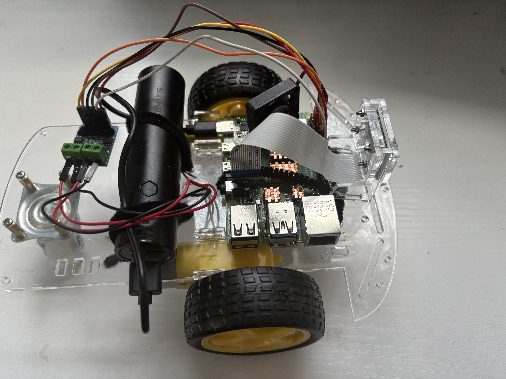
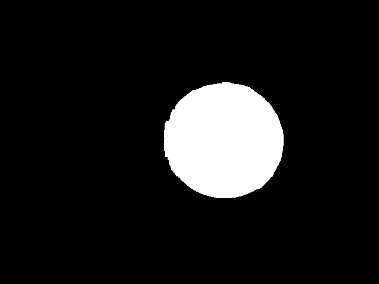
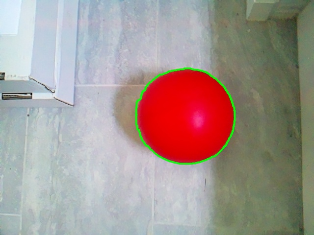
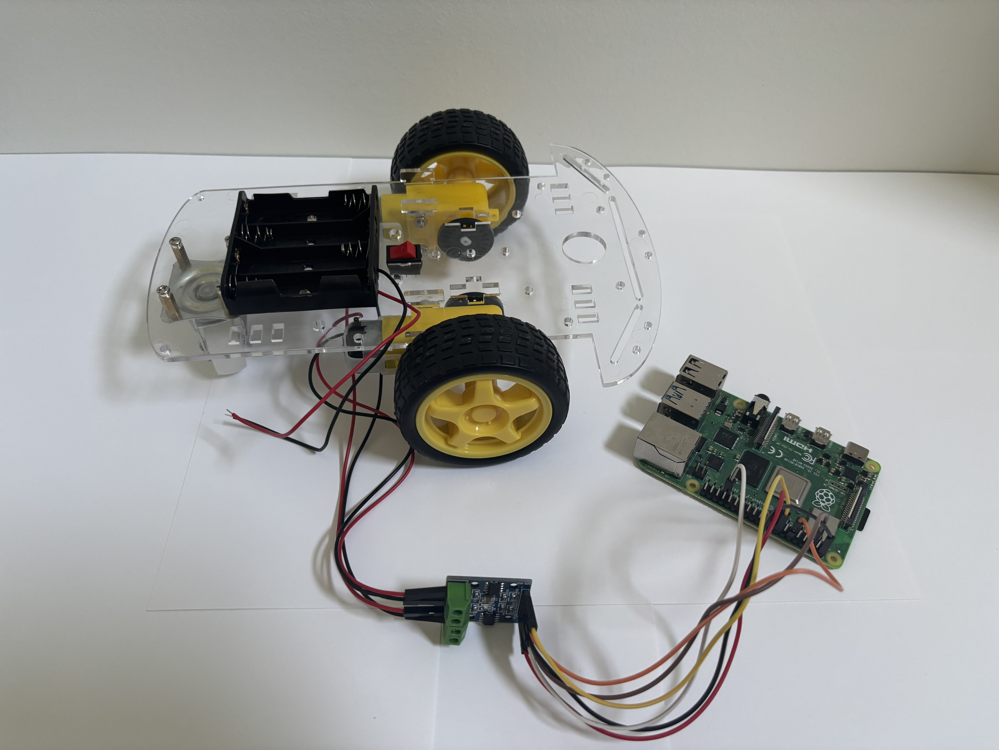
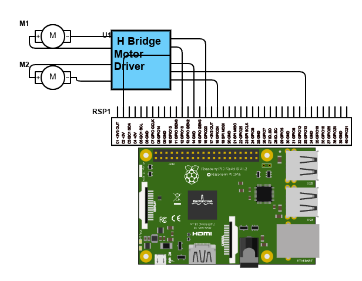
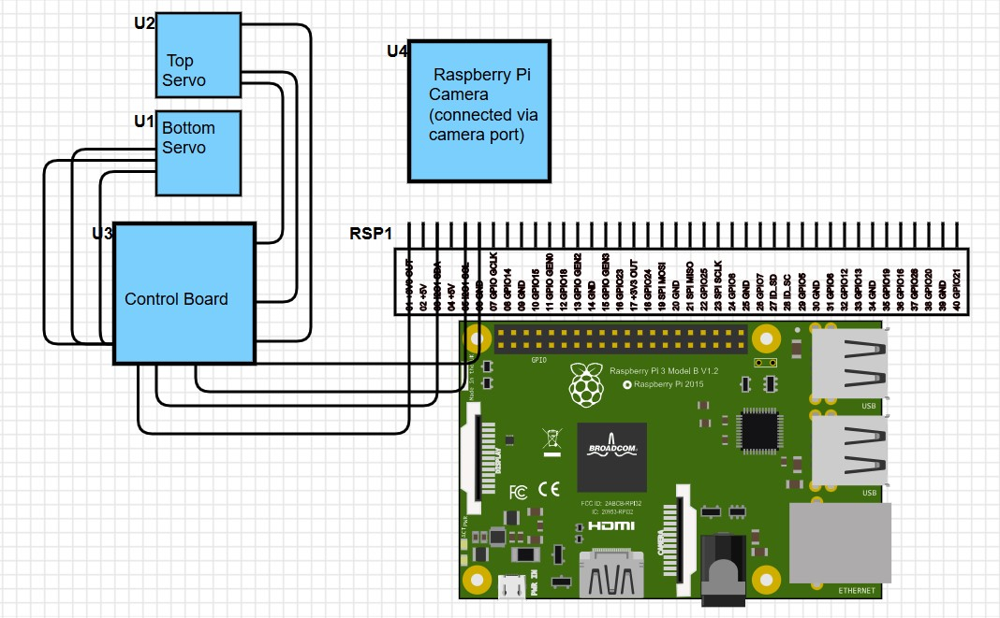

# Ball Tracking Robot
The ball tracking robot utilizes a Raspberry Pi, camera, and open cv to identify and track a red ball.  It also uses a YOLO (You Only Look Once) algorithim to identify animals and objects that enter its field of view.  The robot has potential applications as a wildlife camera or other security and tracking device.


| **Engineer** | **School** | **Area of Interest** | **Grade** |
|:--:|:--:|:--:|:--:|
| Charlotte H | Culver Academies | Mechanical Engineering and Renewable Energy| Incoming Junior

**Replace the BlueStamp logo below with an image of yourself and your completed project. Follow the guide [here](https://tomcam.github.io/least-github-pages/adding-images-github-pages-site.html) if you need help.**


  
# Final Milestone

<iframe width="560" height="315" src="https://www.youtube.com/embed/iatd-i058JA?si=KkX1r_8gO5SHH-nT" title="YouTube video player" frameborder="0" allow="accelerometer; autoplay; clipboard-write; encrypted-media; gyroscope; picture-in-picture; web-share" referrerpolicy="strict-origin-when-cross-origin" allowfullscreen></iframe>

My final milestone included adding a ton of modifications to my robot, including:
- Image recognition software
- Servo as a camera mount
- Ultrasonic distance sensors to prevent crashes
- Some smaller, sillier modifications


### Image Recognition Software
I used pre-existing code (see link below) to run image recognition software on my Raspberry Pi.  I used two different code for this to get different results.  The first runs a live video feed in a browers that automatically identifies and displays what objects or animals are in frame.  I added code so that when a certain thing is identified (I set it to humans but other animals/objects can be used) that frame is saved as a seperate picture.  This also required using a timestamp as part of the file name and regularly calling upon it in the code so it would update.  Someone could switch this out for a variable that regularly changes.  This is very convenient but the feed is very slow.  The second also runs a live feed from the camera in a browers but has buttons to manually take pictures, have those pictures analysed, then stored.  This is less convenient but the feed is much faster.  While using this I noticed that if you take multiple pictures before having it analyze the first one the newest picture will replace the previous ones (it does not save multiple unanalysed pictures).  Both code utilize YOLO (You Only Look Once) algorithm for image detection.  I am hoping that by ultilizing these image recognition capabilities that robot can serve as a wildlife camera.

### Servo
I mounted the Raspberry Pi camera onto a servo (see link to item below).  Servos work differently from the motors for the wheels as they move to a specific position rather than just spinning until stopped.  You can adjust the speeed or torque of a servo but I did not for this project.  The particular servo here only uses C code and as a result the coding process was a lot more complicated.  I first had to learn and run the commands in C (which required a special virtual environment) then combine all the relevnt files into one, make that file a shared filed (so it can be called upon in python), then import the file and use specific python commands so the servo would respond.  Once that was done it was fairly easy to adjust certain variables for the camera to easily track the ball.  In my code I just used servo degree increase or decrease functions and had certain intervals where it would change the degree by more or less.  One could also have the Rapsberry Pi calculate how much the servo angle needs to change based on how offset the ball is (using basic math and a proportionality constant).  I had some issues with the camera ribbon getting caught on the bottom servo and am planning on flipping the camera upside down once I have a longer camera ribbon (and adding code for the camera to flip images verticially so images still apear normall).

### Ultrasonic Distance Sensors
My final major modification was adding distance sensors.  I noticed during Milestone 2 that the robot would slowly shift backwards and forwards as it tracked the ball.  This would cause it to sometimes run into object and I wanted to prevent this from happening.  I only used two distance sensors total, one in the front and one in the back because I was just trying to stop it from running into things, not accurately pin point distance.  Ultrasonic distance sensors work by sending out sound waves which are then reflected of an object back to the sensor which measures the amount of time that takes to calculate distance.  If you wanted to determine if an object is left or right, or dtermine how far it is with accuracy, more distance sensors in a variety of posistions would be needed.  When coding the sensors I adjusted the threshold distance to be very small (I did not adjust the max distance because that was unnecessary) and created a sequence for the robot to follow when something was in this threshold distance (essentially just move forward or backward).

### Miscellaneous Modifications
In addition to the larger modifcatiosn mentioned above, I also added a few smaller or sillier modifications.  The first of these was adding headlights.  They are connected directly to power and always remain on when the Raspberry Pi is on.  These do actually have a function as the help to illuminate the ball from below.  Earlier the camera had some difficulty recognizing the ball when it was directly above it and blocking overhead lights.  Adding lights under makes it easier for the camera to recognize the red color.  Another modifcation was adding red "backing" lights that only turn on when the robot is moving backwards.  These are accompanied by an activate buzzer that is set to turn on and off (beeping) while backing.  For these last two modifcations I had them only activate by adding them into the MotorTest.py code (see below) and they can be easily removed.  I also made a number of modifications that made mounting the different components easier.  The first was cutting pieces of cardboard to fit the robot and give the components a flat surface to rest.  The robot has small plastic pieces that stick up and previously prevented me from placing the Raspberry Pi in the middle of the robot.  I also cut a number of small cardboard rectangles to create a tower for the servo to sit.  This was necessary as I wanted both the front distance sensor and camera to be in the center.

### Final Thoughts
I really appreciated this project and all the fun things I got to add.  There are still other modifications I am looking to make, like the camera flip mentioned above and swapping in different wheels.  There is also currently an issue with how the camera is positioned.  It struggles to look down and because I raised the camera in the final design that problem is even worse.  It can still track the ball on the ground without issue but it does significantly better with objects in teh air.  If there is a particular modifcation you do not what to make, simply remove it from the code.


# Second Milestone
<iframe width="560" height="315" src="https://www.youtube.com/embed/HNuMV7cAn2M?si=xJ1I29sRj3NLZuKR" title="YouTube video player" frameborder="0" allow="accelerometer; autoplay; clipboard-write; encrypted-media; gyroscope; picture-in-picture; web-share" referrerpolicy="strict-origin-when-cross-origin" allowfullscreen></iframe>

My Milestone 2 was having the robot track the ball as it moved.  This included a number of components including:
- Setting up the Raspberry Pi camer, taking a picture and setting up a live feed
- Mounting all of the components onto the robot chassis
- Learning and setting up object tracking

### Setting up Raspberry Pi Camera, Taking a Picture, and Live Feed:
The first step to completing this milestone was setting up the Raspberry Pi camera and installing the necessary packages to use it (like cv2).  After this I moved on to taking a picture with the camera (see code below).  After that, I set up a live feed that streamed from the camera into a browser.  This gives you live updates and tracking (see code below).

### Mounting:
Once every component was working I mounted it on the robot chassis.  This is temporary, as it is currently mounted with pipe cleaners which are not strong and a potential fire hazard.  I will be remounting the components later with double-sided tape.  But, the components have stayed secure and mounting allows the robot to move and turn freely.



### Object Tracking:
In order to track the red ball (or another object) the Raspberry Pi needs to follow a number of steps to first identify where the object is.  These steps, or morphological transformations, include maksing, erosion, dilation, contouring and centriods (in that order).  Masking, the first step, involves telling the Raspberry Pi what to focus on in the image.  In this case that was the red ball.  So, the mask I created focused on anything that was the color red.  In the HSV spectrum that involved any colors with a hue value between 0-10 and 160-179.  Because red is the start of the color wheel (0) it is also the end (180) and you therefore need multiple color arrays to include both of these ranges.  The final image below was produced after applying this mask.  The parts that were identified as red are in white and all other colors in black.  The white is the area that will be detected and the black is the area that is hidden or ignored.  

After the mask is appied the area that the Raspberry Pi needs to focus on is much smaller and erosion and dilation can be applied to further hone in on the object.  Both erosion and dilation work by analyzing the image in small sections to identify which pixels are a part of the object or a part of the background.  Then, the pixels that surround part of the outline or boundary of the object are either turned into the background or object (for either an erosion or dilation).  This process will enlarge or reduce the size of the object depending on which transformation is applied.  Erosions are useful for removing blobs, disconnecting objects, and remove other pizels that may get accidentally picked up.  Dilations are useful for increasing the size of an object, joining broken pieces, and ensuring that the ball is recognized despite imperfections (that may cause parts to be removed).  The impact of the erosion or dilation can be changed by changing the kernel.  By changing the kernel to 5x5 instead of the default size.  This means that the image will be analyzed in 5x5 pixel sections and if any pixel in that section is part of the object, all the pixels in that square will be chnaged (depending on whether it is an erosion or dilation).  The second image (also in black and white) shows how erosion and dilation effects the quality of the mask, making it more precise and focused on the ball.

After maksing, eroding and dilating the image contouring can be applied to detect where the object is.  The previous steps were focused on making it clear what the object is, contouring is the first that actually detects the object.  It works by detecting continous edges in an image.  In the third picture you can see this contour in action as the green line outlining the ball.  You can also see that it is fairly accurate to the shape of the ball, because the eroding and dilating made the mask more accurate to the shape of the ball.  

After contouring creates an outline of the object a centroid can be applied.  This will take a mean of all the x and y values of the pixels in the object to find the center point.  In the fourth image you can see the red ball outlined by contour with a blue dot in the middle, a result of the centroid.  Once the center is identified and labled we can use that point to move the camera to track this center.  The first code I created calculated and displayed how far offset the center of the ball was from the center of the camera and classified is this was "OffsetLEFT" or "OffsetRIGHT".  I then created code so that the robot would turn left or right until the object was in the center of its vision.  This allowed the robot ot track the ball as it moved. (for more information on the code see below)

**Here is an outline on how morphological transitions can effect an image:** 

(With the orginal image, the image after making, erosion and dilation, the image after contouring, and the image with the center identified)


 
 
 
 


*This last image is an example of an image with just a mask, no erosion or dilation.  It is from a different orginal picture then the others


# First Milestone

<iframe width="560" height="315" src="https://www.youtube.com/embed/-CIZu2FILbE?si=ONx-PtDOnmqQH6tI" title="YouTube video player" frameborder="0" allow="accelerometer; autoplay; clipboard-write; encrypted-media; gyroscope; picture-in-picture; web-share" referrerpolicy="strict-origin-when-cross-origin" allowfullscreen></iframe>


My major first milestone was creating code to control the robot chassis' movements.  I began by moving each wheel individually before condensing the code to easily call upon the chassis to move forward, backward, left and right (see code below).  There were a number of smaller steps necessary to meet this first milestone including:
- Setting up, troubleshooting, and connecting to the Raspberry Pi
- Building the robot chassis
- Learning how to navigate Visual Studio Code

# Schematics 


# Code (at Milestones)
This is my code from Milestone 1.  It utilizes the library to import features like the GPIO pins and time.  Defining variables and functions is the backbone of the code, beginning with defining various GPIO pins as motor inputs.  I then do some important set-up things, including setting the GPIO pins as outputs (so they will respond to code telling them to output certain signals), setting the Hz for the PWM pins (so speed of motors can be adjusted), and defining how the motors should be at the beginning of the code.  I then define the basic motor movements.  The motor driver that I am using controls two motors and moves the wheel forward or backward based on what recieves power form the Raspberry Pi (ex. A_1A receiving power but A_1B not will move motor A backwards).  Using these basic motor movemnets, I further condensed the code to create commands to move the robot forward, backward, left, and right.  The code ends with a test sequence that allows one to test different parts of the code.  I repeatedly edited thsi portion to ensure that all parts of the code was functioning.  By using "try" and "finally" instead of "while True" ensured that the motors would stop after the test (as a ending sequence can be coded).

```python
# Motor A and B pins
B_1A = 24
B_1B = 13
A_1A = 18
A_1B = 23

#Set up
import RPi.GPIO as GPIO
import time


GPIO.setmode(GPIO.BCM)
GPIO.setwarnings(False)

for pin in [A_1A, A_1B, B_1A, B_1B]:
    GPIO.setup(pin, GPIO.OUT)

#PWM at 100 Hz
pwm_A_1A = GPIO.PWM(A_1A, 100)
pwm_A_1B = GPIO.PWM(A_1B, 100)
pwm_B_1A = GPIO.PWM(B_1A, 100)
pwm_B_1B = GPIO.PWM(B_1B, 100)

pwm_A_1A.start(0)
pwm_A_1B.start(0)
pwm_B_1A.start(0)
pwm_B_1B.start(0)

#Define motor movements

def MotorA_forward(speed=100):
    pwm_A_1A.ChangeDutyCycle(0)
    pwm_A_1B.ChangeDutyCycle(speed)

def MotorA_backward(speed=100):
    pwm_A_1A.ChangeDutyCycle(speed)
    pwm_A_1B.ChangeDutyCycle(0)

def MotorB_forward(speed=100):
    pwm_B_1A.ChangeDutyCycle(speed)
    pwm_B_1B.ChangeDutyCycle(0)

def MotorB_backward(speed=100):
    pwm_B_1A.ChangeDutyCycle(0)
    pwm_B_1B.ChangeDutyCycle(speed)

def stop_all(speed=0):
    for pwm in [pwm_A_1A, pwm_A_1B, pwm_B_1A, pwm_B_1B]:
        pwm.ChangeDutyCycle(0)
        pwm.ChangeDutyCycle(speed)
    pwm_A_1A.stop()
    pwm_A_1B.stop()
    pwm_B_1A.stop()
    pwm_B_1B.stop()

def forward (speed=100):
    MotorB_forward()
    MotorA_forward()

def backward (speed=100):
    MotorA_backward()
    MotorB_backward()

def right (speed=100):
    MotorB_forward()
    time.sleep(1)
    pwm_B_1A.ChangeDutyCycle(0)
    pwm_B_1B.ChangeDutyCycle(0)


   

def left (speed=100):
    MotorA_forward()
    time.sleep(1)
    pwm_A_1A.ChangeDutyCycle(0)
    pwm_A_1B.ChangeDutyCycle(0)

    
    
    
#test sequence

try:
    time.sleep(7)
    print("Motors forward and backward")
    forward()
    time.sleep(1)
    backward()
    time.sleep(1)
    print("Motor right and left")
    right()
    time.sleep(1)
    left()
    time.sleep(1)

finally:
    stop_all()
    print("Test complete")
    GPIO.cleanup()


```
Here is the code at the second Milestone (the names are what I have named the files).  The first two sets of code set up what the robot draws upon to track the ball.  The motor function (MotorTest.py) has been modified from the first Milestone to allow the robot to better adjust its position and track the ball more precisely.  The second set of code (Camera2.py) starts by importing the necessary packages, takes a pictures, then applies the morphological transition discussed above (masking, eroding, dilating, contouring, and centroid) in order to identify where the ball is in that picture.  The final set of code (Video.py) also begins by importing the necessary packages (imcluding MotorTest.py to draw upon the motor functions).  It creates a function that tracks the red ball as it moves by defining how far offset the ball is the calling upon the correct motor function to move the necessary amount.  It then creates a way to view the live video feed from the camera in a browser.

### MotorTest.py
```python
# Motor A and B pins
B_1A = 24
B_1B = 13
A_1A = 18
A_1B = 23

import RPi.GPIO as GPIO
import time


GPIO.setmode(GPIO.BCM)
GPIO.setwarnings(False)

for pin in [A_1A, A_1B, B_1A, B_1B]:
    GPIO.setup(pin, GPIO.OUT)

#PWM at 100 Hz
pwm_A_1A = GPIO.PWM(A_1A, 100)
pwm_A_1B = GPIO.PWM(A_1B, 100)
pwm_B_1A = GPIO.PWM(B_1A, 100)
pwm_B_1B = GPIO.PWM(B_1B, 100)

pwm_A_1A.start(0)
pwm_A_1B.start(0)
pwm_B_1A.start(0)
pwm_B_1B.start(0)

#Define motor movements

def MotorA_forward(speed=100):
    pwm_A_1A.ChangeDutyCycle(0)
    pwm_A_1B.ChangeDutyCycle(speed)

def MotorA_backward(speed=100):
    pwm_A_1A.ChangeDutyCycle(speed)
    pwm_A_1B.ChangeDutyCycle(0)

def MotorB_forward(speed=100):
    pwm_B_1A.ChangeDutyCycle(speed)
    pwm_B_1B.ChangeDutyCycle(0)

def MotorB_backward(speed=100):
    pwm_B_1A.ChangeDutyCycle(0)
    pwm_B_1B.ChangeDutyCycle(speed)

def stop_all(speed=100):
    for pwm in [pwm_A_1A, pwm_A_1B, pwm_B_1A, pwm_B_1B]:
        pwm.ChangeDutyCycle(speed)

def forward (speed=100):
    MotorB_forward()
    MotorA_forward()

def backward (speed=100):
    MotorA_backward()
    MotorB_backward()


def rightMajor (speed=50):
    MotorB_forward()
    MotorA_backward()
    time.sleep(0.10)
    MotorA_forward()
    MotorB_forward()
    time.sleep(.0001)
    stop_all()
    time.sleep(0.10)
    

    
def rightSmall (speed=1):
    MotorB_forward()
    MotorA_backward()
    time.sleep(0.001)
    stop_all()
    time.sleep(0.06)


def leftMajor (speed=50):
    MotorA_forward()
    MotorB_backward()
    time.sleep(0.10)
    stop_all()
    time.sleep(0.10)


def leftSmall (speed=1):
    MotorA_forward()
    MotorB_backward()
    time.sleep(0.001)
    stop_all()
    time.sleep(0.06)

```

### Camera2.py
```python
from picamera2 import Picamera2
import cv2
import numpy as np


#Intilialize and configure the camera
picam2= Picamera2()
picam2.configure(picam2.create_preview_configuration(main={"format": "RGB888", "size": (640,480)}))
picam2.start()

#capture one frame
frame = picam2.capture_array()

#save to file
cv2.imwrite("ogframe.jpg", frame)
print("Frame saved as ogframe.jpg")

#save into var image
image = frame
hsv_image = cv2.cvtColor(image, cv2.COLOR_RGB2HSV)

lower_red = np.array([0, 50, 50])
upper_red = np.array([10, 255, 255])
lower_red2 = np.array([160, 100, 100])
upper_red2 = np.array([179, 255, 255])

kernel = np.ones((5,5), np.int8)

mask1 = cv2.inRange(hsv_image, lower_red, upper_red)
mask2 = cv2.inRange(hsv_image, lower_red2, upper_red2)
mask = cv2.bitwise_or(mask1, mask2)
mask = cv2.erode(mask, kernel, iterations=2)
mask = cv2.dilate(mask, kernel, iterations=2)
image_copy = image.copy()


contours, _ =cv2.findContours(mask, cv2.RETR_EXTERNAL, cv2.CHAIN_APPROX_SIMPLE)

#find the largest contour by area
if contours:
    largest_contour= max(contours, key=cv2.contourArea)
cv2.drawContours(image=image_copy, contours=[largest_contour], contourIdx=-1,color=(0,255,0), thickness=2, lineType=cv2.LINE_AA)


M = cv2.moments(largest_contour)
if M['m00']>0:
    cx = int(M["m10"]/ M["m00"])
    cy = int(M["m01"]/ M["m00"])
    cv2.circle(image_copy, (cx, cy), 5, (255, 0, 0), -1)

#save to file
cv2.imwrite("resultframe.jpg", image_copy)
print("Frame saved as resultframe.jpg")


```

### Video.py
```python
from flask import Flask, Response, render_template_string
app = Flask(__name__)
import cv2
import numpy as np
from picamera2 import Picamera2
import RPi.GPIO as GPIO
import time
from MotorTest import *

app = Flask(__name__)

#initialize PiCam
picam2= Picamera2()
picam2.configure(picam2.create_preview_configuration(main={"format": "BGR888", "size": (640,480)}))
picam2.start()

FRAME_WIDTH = 640
CENTER_X = FRAME_WIDTH // 2

def track_red_ball(frame):
    image = frame
    hsv_image = cv2.cvtColor(image, cv2.COLOR_BGR2HSV)

    lower_red = np.array([0, 50, 50])
    upper_red = np.array([10, 255, 255])
    lower_red2 = np.array([160, 100, 100])
    upper_red2 = np.array([179, 255, 255])

    kernel = np.ones((5,5), np.int8)

    mask1 = cv2.inRange(hsv_image, lower_red, upper_red)
    mask2 = cv2.inRange(hsv_image, lower_red2, upper_red2)
    mask = cv2.bitwise_or(mask1, mask2)
    mask = cv2.erode(mask, kernel, iterations=2)
    mask = cv2.dilate(mask, kernel, iterations=2)
    image_copy = image.copy()

    contours, _ =cv2.findContours(mask, cv2.RETR_EXTERNAL, cv2.CHAIN_APPROX_SIMPLE)
    if contours:
        largest_contour= max(contours, key=cv2.contourArea)
        cv2.drawContours(image=image_copy, contours=[largest_contour], contourIdx=-1,color=(0,255,0), thickness=2, lineType=cv2.LINE_AA)
        M = cv2.moments(largest_contour)
        if M['m00']>0:
            cx = int(M["m10"]/ M["m00"])
            cy = int(M["m01"]/ M["m00"])
            cv2.circle(image_copy, (cx, cy), 5, (255, 0, 0), -1)
                
            
            if( cx-140 > CENTER_X):
                position = "OffsetRIGHTMajor"
                rightMajor()
            elif( cx-70 > CENTER_X):
                position = "OffsetRIGHTSmall"
                rightSmall()
            elif(cx+140 < CENTER_X):
                position = "OffsetLEFTMajor"
                leftMajor()
            elif(cx+70 < CENTER_X):
                position = "OffsetLEFTSmall"
                leftSmall()
            else:
                position = "Centered"
                stop_all()
            

            cv2.putText(image_copy, f"Offset: {cx-CENTER_X} ({position})", (10, 30),
                            cv2.FONT_HERSHEY_SIMPLEX, 0.7, (255, 255, 255), 2)
            

    return image_copy
    

def generate_frames():
    while True:
        frame = picam2.capture_array()
        frame = cv2.cvtColor(frame, cv2.COLOR_RGB2BGR)
        frame = track_red_ball(frame) 
        ret, buffer = cv2.imencode('.jpg', frame)
        jpg_frame = buffer.tobytes()
        yield (b'--frame\r\n'
               b'Content-Type: image/jpeg\r\n'
               b'Content-Length: ' + f"{len(jpg_frame)}".encode() + b'\r\n\r\n' +
               jpg_frame + b'\r\n')


@app.route('/')
def index():
    return render_template_string('''
        <html>
            <head><title>Red Ball Tracking Stream</title></head>
            <body>
                <h2>Live Tracking</h2>
                
            </body>
        </html>
    ''')


@app.route('/video_feed')
def video_feed():
    return Response(generate_frames(),
                    mimetype='multipart/x-mixed-replace; boundary=frame')

if __name__ == '__main__':
    app.run(host='0.0.0.0', port=5000)


```

# Code (Final)

### MotorTest.py
```python
# Motor A and B pins
B_1A = 24
B_1B = 13
A_1A = 18
A_1B = 23

#Set up
import RPi.GPIO as GPIO
import time
from gpiozero import LED
led1 = LED(11)
led2 = LED(8)


GPIO.setmode(GPIO.BCM)
GPIO.setwarnings(False)
GPIO.setup(21, GPIO.OUT)

#Set pins as outputs

for pin in [A_1A, A_1B, B_1A, B_1B]:
    GPIO.setup(pin, GPIO.OUT)

#PWM at 100 Hz
pwm_A_1A = GPIO.PWM(A_1A, 100)
pwm_A_1B = GPIO.PWM(A_1B, 100)
pwm_B_1A = GPIO.PWM(B_1A, 100)
pwm_B_1B = GPIO.PWM(B_1B, 100)

pwm_A_1A.start(0)
pwm_A_1B.start(0)
pwm_B_1A.start(0)
pwm_B_1B.start(0)

#Define motor movements

def MotorA_forward(speed=100):
    pwm_A_1A.ChangeDutyCycle(0)
    pwm_A_1B.ChangeDutyCycle(speed)

def MotorA_backward(speed=100):
    pwm_A_1A.ChangeDutyCycle(speed)
    pwm_A_1B.ChangeDutyCycle(0)

def MotorB_forward(speed=100):
    pwm_B_1A.ChangeDutyCycle(speed)
    pwm_B_1B.ChangeDutyCycle(0)

def MotorB_backward(speed=100):
    pwm_B_1A.ChangeDutyCycle(0)
    pwm_B_1B.ChangeDutyCycle(speed)

def stop_all(speed=100):
    for pwm in [pwm_A_1A, pwm_A_1B, pwm_B_1A, pwm_B_1B]:
        pwm.ChangeDutyCycle(speed)
    GPIO.output(21, GPIO.LOW)

def forward (speed=100):
    MotorB_forward()
    MotorA_forward()

def backward (speed=100):
    MotorA_backward()
    MotorB_backward()
    led1.on()
    led2.on()
    GPIO.output(21, GPIO.HIGH)
    time.sleep(0.5)
    GPIO.output(21, GPIO.LOW)
    time.sleep(0.5)


def rightMajor (speed=50):
    MotorB_forward()
    MotorA_backward()
    time.sleep(0.10)
    MotorA_forward()
    MotorB_forward()
    time.sleep(.0001)
    stop_all()
    time.sleep(0.10)
    

    
def rightMinor (speed=1):
    MotorB_forward()
    MotorA_backward()
    time.sleep(0.001)
    stop_all()
    time.sleep(0.06)


def leftMajor (speed=50):
    MotorA_forward()
    MotorB_backward()
    time.sleep(0.10)
    stop_all()
    time.sleep(0.10)


def leftMinor (speed=1):
    MotorA_forward()
    MotorB_backward()
    time.sleep(0.001)
    stop_all()
    time.sleep(0.06)


```
### Sensor.py
```python
#set up
from gpiozero import DistanceSensor
ultrasonic2 = DistanceSensor(echo=19, trigger=12, threshold_distance=0.1)
ultrasonic1 = DistanceSensor(echo=6, trigger=5, threshold_distance=0.1)
from MotorTest import *
import time

#Defining what to do when the front of back sensor gets too close to an object
def closeF():
    print("Too close")
    backward()
    time.sleep(0.4)
    stop_all()
    time.sleep(0.1)
    print(ultrasonic1.distance)

def closeB():
    print("Too close")
    forward()
    time.sleep(0.4)
    stop_all()
    time.sleep(0.1)
    print(ultrasonic2.distance)

```

### VideoMobile.py
```python
#Set up
from flask import Flask, Response, render_template_string
app = Flask(__name__)
import cv2
import numpy as np
from picamera2 import Picamera2
import RPi.GPIO as GPIO
import time
from MotorTest import *
from ctypes import *
from Sensor import *
total = CDLL("./PCA9685/example/rpi/total2.so")
total.main()


app = Flask(__name__)

#initialize PiCam
picam2= Picamera2()
picam2.configure(picam2.create_preview_configuration(main={"format": "BGR888", "size": (640,480)}))
picam2.start()

FRAME_WIDTH = 640
CENTER_X = FRAME_WIDTH // 2

#Defining the main function that tracks the ball

def track_red_ball(frame):
    #Finidng the correct object and  it center 
    image = frame
    hsv_image = cv2.cvtColor(image, cv2.COLOR_BGR2HSV)

    lower_red = np.array([0, 50, 50])
    upper_red = np.array([10, 255, 255])
    lower_red2 = np.array([160, 100, 100])
    upper_red2 = np.array([179, 255, 255])

    kernel = np.ones((5,5), np.int8)

    mask1 = cv2.inRange(hsv_image, lower_red, upper_red)
    mask2 = cv2.inRange(hsv_image, lower_red2, upper_red2)
    mask = cv2.bitwise_or(mask1, mask2)
    mask = cv2.erode(mask, kernel, iterations=2)
    mask = cv2.dilate(mask, kernel, iterations=2)
    image_copy = image.copy()

    contours, _ =cv2.findContours(mask, cv2.RETR_EXTERNAL, cv2.CHAIN_APPROX_SIMPLE)
    if contours:
        largest_contour= max(contours, key=cv2.contourArea)
        cv2.drawContours(image=image_copy, contours=[largest_contour], contourIdx=-1,color=(0,255,0), thickness=2, lineType=cv2.LINE_AA)
        M = cv2.moments(largest_contour)
        if M['m00']>0:
            cx = int(M["m10"]/ M["m00"])
            cy = int(M["m01"]/ M["m00"])
            cv2.circle(image_copy, (cx, cy), 5, (255, 0, 0), -1)
                
            #Telling the servo how to turn after the center of the object has been identified
            if( cx-140 > CENTER_X):
                position = "OffsetRIGHTMajor"
                rightMajor()
                if ultrasonic1.in_range:
                    closeF()
                elif ultrasonic2.in_range:
                    closeB()

            elif( cx-70 > CENTER_X):
                position = "OffsetRIGHTMinor"
                rightMinor()
                if ultrasonic1.in_range:
                    closeF()
                elif ultrasonic2.in_range:
                    closeB()

            elif(cx+140 < CENTER_X):
                position = "OffsetLEFTMajor"
                leftMajor()
                if ultrasonic1.in_range:
                    closeF()
                elif ultrasonic2.in_range:
                    closeB()

            elif(cx+70 < CENTER_X):
                position = "OffsetLEFTMinor"
                leftMinor()
                if ultrasonic1.in_range:
                    closeF()
                elif ultrasonic2.in_range:
                    closeB()


            else:
                position = "Centered"
                stop_all()
                if ultrasonic1.in_range:
                    closeF()
                elif ultrasonic2.in_range:
                    closeB()

            

            cv2.putText(image_copy, f"Offset: {cx-CENTER_X} ({position})", (10, 30),
                            cv2.FONT_HERSHEY_SIMPLEX, 0.7, (255, 255, 255), 2)
            

    return image_copy
    
#Generating the live feed
def generate_frames():
    while True:
        frame = picam2.capture_array()
        frame = cv2.cvtColor(frame, cv2.COLOR_RGB2BGR)
        frame = track_red_ball(frame) 
        ret, buffer = cv2.imencode('.jpg', frame)
        jpg_frame = buffer.tobytes()
        yield (b'--frame\r\n'
               b'Content-Type: image/jpeg\r\n'
               b'Content-Length: ' + f"{len(jpg_frame)}".encode() + b'\r\n\r\n' +
               jpg_frame + b'\r\n')


#Putting that live feed in html for vieiwng in a browser
@app.route('/')
def index():
    return render_template_string('''
        <html>
            <head><title>Red Ball Tracking Stream</title></head>
            <body>
                <h2>Live Tracking</h2>
                
            </body>
        </html>
    ''')


@app.route('/video_feed')
def video_feed():
    return Response(generate_frames(),
                    mimetype='multipart/x-mixed-replace; boundary=frame')

if __name__ == '__main__':
    app.run(host='0.0.0.0', port=5000)

```

### VideoStationary.py
```python
#Set up
from flask import Flask, Response, render_template_string
app = Flask(__name__)
import cv2
import numpy as np
from picamera2 import Picamera2
import RPi.GPIO as GPIO
import time
from MotorTest import *
from ctypes import *
total = CDLL("./PCA9685/example/rpi/total2.so")
total.main()

app = Flask(__name__)

#initialize PiCam
picam2= Picamera2()
picam2.configure(picam2.create_preview_configuration(main={"format": "BGR888", "size": (640,480)}))
picam2.start()

FRAME_WIDTH = 640
FRAME_HEIGHT = 640
CENTER_X = FRAME_WIDTH // 2

#Defining the main function that tracks the ball
def track_red_ball(frame):
    #Finidng the correct object and  it center 
    image = frame
    hsv_image = cv2.cvtColor(image, cv2.COLOR_BGR2HSV)


    lower_red = np.array([0, 50, 50])
    upper_red = np.array([10, 255, 255])
    lower_red2 = np.array([160, 100, 100])
    upper_red2 = np.array([179, 255, 255])

    kernel = np.ones((5,5), np.int8)

    mask1 = cv2.inRange(hsv_image, lower_red, upper_red)
    mask2 = cv2.inRange(hsv_image, lower_red2, upper_red2)
    mask = cv2.bitwise_or(mask1, mask2)
    mask = cv2.erode(mask, kernel, iterations=2)
    mask = cv2.dilate(mask, kernel, iterations=2)
    image_copy = image.copy()

    contours, _ =cv2.findContours(mask, cv2.RETR_EXTERNAL, cv2.CHAIN_APPROX_SIMPLE)
    if contours:
        largest_contour= max(contours, key=cv2.contourArea)
        cv2.drawContours(image=image_copy, contours=[largest_contour], contourIdx=-1,color=(0,255,0), thickness=2, lineType=cv2.LINE_AA)
        M = cv2.moments(largest_contour)
        if M['m00']>0:
            cx = int(M["m10"]/ M["m00"])
            cy = int(M["m01"]/ M["m00"])
            cv2.circle(image_copy, (cx, cy), 5, (255, 0, 0), -1)
                
              #Telling the robot how to turn after the center of the object has been identified
            if( cx-170 > CENTER_X):
                position = "OffsetRIGHTMajor"
                total.ServoDegreeIncrease(0,8)

            elif( cx-140 > CENTER_X):
                position = "OffsetRIGHTMinor"
                total.ServoDegreeIncrease(0,6)

            elif( cx-70 > CENTER_X):
                position = "OffsetRIGHTMicro"
                total.ServoDegreeIncrease(0,4)
            elif(cx+170 < CENTER_X):
                position = "OffsetLEFTMajor"
                total.ServoDegreeDecrease(0,8)
            
            elif(cx+140 < CENTER_X):
                position = "OffsetLEFTMinor"
                total.ServoDegreeDecrease(0,6)

            elif(cx+70 < CENTER_X):
                position = "OffsetLEFTMicro"
                total.ServoDegreeDecrease(0,4)
            
            elif(cy-120 > CENTER_X):
                    position = "OffsetDOWNMajor"
                    total.ServoDegreeDecrease(1,10)
            elif(cy-50 > CENTER_X):
                    position = "OffsetDOWNMinor"
                    total.ServoDegreeDecrease(1,5)
            elif(cy+140 < CENTER_X):
                    position = "OffsetUPMajor"
                    total.ServoDegreeIncrease(1,8)
            elif(cy+70 < CENTER_X):
                    position = "OffsetUPMinor"
                    total.ServoDegreeIncrease(1,5)


            else:
                position = "Centered"
                stop_all()

            

            cv2.putText(image_copy, f"Offsetx: {cx-CENTER_X} ({position})", (10, 30),
                            cv2.FONT_HERSHEY_SIMPLEX, 0.7, (255, 255, 255), 2)
    return image_copy
    
#Generating the live feed
def generate_frames():
    while True:
        frame = picam2.capture_array()
        frame = cv2.cvtColor(frame, cv2.COLOR_RGB2BGR)
        frame = track_red_ball(frame) 
        ret, buffer = cv2.imencode('.jpg', frame)
        jpg_frame = buffer.tobytes()
        yield (b'--frame\r\n'
               b'Content-Type: image/jpeg\r\n'
               b'Content-Length: ' + f"{len(jpg_frame)}".encode() + b'\r\n\r\n' +
               jpg_frame + b'\r\n')


#Putting that lie feed in html for vieiwng in a browser
@app.route('/')
def index():
    return render_template_string('''
        <html>
            <head><title>Red Ball Tracking Stream</title></head>
            <body>
                <h2>Live Tracking</h2>
                
            </body>
        </html>
    ''')


@app.route('/video_feed')
def video_feed():
    return Response(generate_frames(),
                    mimetype='multipart/x-mixed-replace; boundary=frame')

if __name__ == '__main__':
    app.run(host='0.0.0.0', port=5000)


```
Please note that the code for the image recogition abilities are not here.  You can access them using the following links (also at the bottom):
- [Object Recognition Code Automatic](https://github.com/notindenial/Pi-Object-Recognition/)
- [Object Recognition Code Manual](https://github.com/sentairanger/YOLO11n-PiCamera2-Livestream/)


# Bill of Materials
Here's where you'll list the parts in your project. To add more rows, just copy and paste the example rows below.
Don't forget to place the link of where to buy each component inside the quotation marks in the corresponding row after href =. Follow the guide [here]([url](https://www.markdownguide.org/extended-syntax/)) to learn how to customize this to your project needs. 

| **Part** | **Note** | **Price** | **Link** |
|:--:|:--:|:--:|:--:|
| Raspberry Pi 4 Starter Kit | The microcontroller powering and controlling this project | $95.19 | <a href="https://www.amazon.com/RasTech-Raspberry-Starter-Heatsink-Screwdriver/dp/B0C8LV6VNZ/ref=sr_1_4?crid=3506HY00MCGVM&dib=eyJ2IjoiMSJ9._zkM62vSQ8p7tNr88715LdMv_qHh72Je-tkF9PXEa3chDE53QT4aZu4AGAb4ihE61QY4ZD55nKF6Fp2Kfs8t7AbafM_JrlJFfHo9OB4eAVGqa0EB-7aoBQHPmhKHZ2MW8ny-Kd44bMVlVxPlTWVk5YHIN5P3uKVqrE5Dcal0rKkHny-O6Xyb5ux2AOU6OwVbkag_bqBX66RQNRrgBuz-0pS43mcx93IZTQA9R8NaJJypYU2HAycp-XicTFmyU60a01Nfm9iuyo6B9yA8ppN3OQQyJ-NQ9xyNPxfTLwkqtng.yAYpU6outhQcZmOZhN9Wb6yTw7A85CNUbXZguGInZNg&dib_tag=se&keywords=raspberry%2Bpi%2Bkit&qid=1718848547&s=electronics&sprefix=rasbperry%2Bpi%2Bkit%2Celectronics%2C83&sr=1-4&th=1/"> Link </a> |
| Robot Chassis | Basic body for the robot | $18.99 | <a href="https://www.amazon.com/Smart-Chassis-Motors-Encoder-Battery/dp/B01LXY7CM3/"> Link </a> |
| Screwdriver Kit | Screwing in screws of different sizes | $5.94 | <a href="https://www.amazon.com/Small-Screwdriver-Set-Mini-Magnetic/dp/B08RYXKJW9/"> Link </a> |
| Ultrasonic Sensor | Sensor used to prevent crashes | $9.99 | <a href="https://www.amazon.com/WWZMDiB-HC-SR04-Ultrasonic-Distance-Measuring/dp/B0CQCCGXCP/ref=sr_1_1_sspa?crid=3J2JR973WKPHO&dib=eyJ2IjoiMSJ9.E2SIkElJhtFWCJCHL5Q6Y73Ys_HCMPRVFCIrG_zKv4Og7BdZNtr69Mkju140lhlfzFGQuY542jpsp8FMrtV9d2hCBI7D8lYTH9bcgDXZhs4941uj-d1D69ZYdKmAI1Jig3VmYXOl3axVQ8Jq5L3nGRymNMtNbxkaFqGNyzkq4p37hhxU6jheuoaMo3Onz2FE9ILThkjUbdxRNW3rrZgZ7bYj9mf-yav85hBAmNduYyo.EneY3GmHDfDjDwhdUdDQ4Ktk6fECH62Adb42cEkehRc&dib_tag=se&keywords=ultrasonic%2Bsensor&qid=1715961326&sprefix=ultrasonic%2Bsensor%2Caps%2C72&sr=8-1-spons&sp_csd=d2lkZ2V0TmFtZT1zcF9hdGY&th=1/"> Link </a> |
| H Bridges | Motor driver to connect motors to the Rapsberry Pi and control them | $8.99 | <a href="https://www.amazon.com/ACEIRMC-Stepper-Controller-2-5-12V-H-Bridge/dp/B0923VMKSZ/"> Link </a> |
| Pi Cam | Camera used to take pictures and stream live feed | $12.86 | <a href="https://www.amazon.com/gp/product/B07RWCGX5K/ref=ox_sc_act_title_1?smid=A2IAB2RW3LLT8D&th=1/"> Link </a> |
| Electronics Kit | Basic electronic components in circuits and breadboard | $11.98 | <a href="https://www.amazon.com/EL-CK-002-Electronic-Breadboard-Capacitor-Potentiometer/dp/B01ERP6WL4/ref=sr_1_4?crid=30T5LTYVQLQ7Z&dib=eyJ2IjoiMSJ9.XZtpck6Llt4UIuYeKM4X3BoXzDuzolZMTCtFDj-oTh1vuIi0HYJZJEdpS-MCdGCK1AWUbUmgoEswoRPxGUSKeGRTzsciRE_l2Vrp8FGX1SxK-HmibPNyHBEtkFJKo_OYmMhkhdCJ4OIH38ALRfFvrXZ7OU5faZVvkTBqod8p7UZYwNwdLCcimwFWGWKaDa-gbbx_TGk7lYQmEbrzeL4UXM-gW3RDtuOV0dCykxwyvYJKCCcOhrK3f18N4NZjiqL_Y5noE1rQTmwyFcG67DzgpNaUPanwIQaYfCe5mgD-njY.v6mU1wYX4M5ShCiyrZMey0hbOwvqLszD8axpHbKlA6I&dib_tag=se&keywords=mini+breadboard+kit&qid=1716419767&s=electronics&sprefix=mini+breadboard+kit%2Celectronics%2C106&sr=1-4/"> Link </a> |
| Motors | Used to turn wheels | $11.98 | <a href="https://www.amazon.com/AEDIKO-Motor-Gearbox-200RPM-Ratio/dp/B09N6NXP4H/ref=sr_1_4?crid=1JP29NIWBLH2M&dib=eyJ2IjoiMSJ9.Wq3jKgOLbqtEP772vMD4pV5f-w3PLBdEpKqguykXOb0JFO14f4Dq0m_VDVUMUFtR8WFINUEticI3GXcoGqwXPqK9yIh04PhCktgccMz9zAUiKXMJPwmOTUp_6av3XuFD0lXo9WngN9iKI6YgZrhEEs9qnqbcB1GnvgntCdKz8Q1dFuNu61NgSE6Z8vBk3FRpaNcr1lCI7FApTiNi0Qce8gbfmMn6oUggZQHpIOKKZ6s.M7WsZ_ZZtm3rm93kKgw0NOxt1McVBYX6m55oGxu1xxI&dib_tag=se&keywords=dc+motor+with+gearbox&qid=1715911706&sprefix=dc+motor+with+gearbox%2Caps%2C126&sr=8-4/"> Link </a> |
| Digital Multimeter | Checking current in circuit | $11.00 | <a href="https://www.amazon.com/AstroAI-Digital-Multimeter-Voltage-Tester/dp/B01ISAMUA6/ref=sxin_17_pa_sp_search_thematic_sspa?content-id=amzn1.sym.e8da13fc-7baf-46c3-926a-e7e8f63a520b%3Aamzn1.sym.e8da13fc-7baf-46c3-926a-e7e8f63a520b&cv_ct_cx=digital%2Bmultimeter&dib=eyJ2IjoiMSJ9.5LQumrfBR8l0mKnJCJlRg73dxpou0gqYD_ffU3srgs0Utegwth8GcQCSVXVzeZeLSJx5J3itz5TLdmJHsrVITQ.-00jRPoT-bBy26YC4LzQ-S4cYdztgmSMGb83_WEm6HY&dib_tag=se&keywords=digital%2Bmultimeter&pd_rd_i=B01ISAMUA6&pd_rd_r=e1ff2570-7e4a-4906-bc55-6f819d48d1bc&pd_rd_w=h7HgL&pd_rd_wg=0ZcFH&pf_rd_p=e8da13fc-7baf-46c3-926a-e7e8f63a520b&pf_rd_r=R6YKX3NXTDQ1PQP4H8RM&qid=1715911879&sbo=RZvfv%2F%2FHxDF%2BO5021pAnSA%3D%3D&sr=1-1-7efdef4d-9875-47e1-927f-8c2c1c47ed49-spons&sp_csd=d2lkZ2V0TmFtZT1zcF9zZWFyY2hfdGhlbWF0aWM&th=1/"> Link </a> |
| Champion Sports Ball | The ball that the robot tracks | $16.73 | <a href="https://www.amazon.com/Champion-Sports-Inch-Coated-Density/dp/B000KYTTYO/ref=sr_1_2_sspa?dib=eyJ2IjoiMSJ9.TLCeZ2jjYwnvK3RiJf14C4RstYOZXhRWTRbHkmLGiNfm5Vd8mVjvtsbUnBFk0S4d6cW9cPT7XDdhwMcPC30nsNwer7Uim0JVF49R8Od82u3RH4TY4mO1uP5LtqdvIEcW7CaOm7AzQ6xOvWQ4say1Ci9eGOxETDRWJP5rewLnqARbrvbe4kh-b2d5NHCLEsarPl16pM1UVlmQCXfMRksXigf_GpckmWPjeUM1AC8iiU0.lGUWr3-ZcZJNl0nJ2JaU6JEUOF9oR26lf0kUvETdmtM&dib_tag=se&keywords=7+inch+red+ball&qid=1748284272&sr=8-2-spons&sp_csd=d2lkZ2V0TmFtZT1zcF9hdGY&psc=1/"> Link </a> |
| AA Batteries | Batteries for the multimeter and alternative power for the robot | $18.74 | <a href="https://www.amazon.com/Duracell-Coppertop-AA-Ingredients-Long-lasting/dp/B0035LCFNQ/ref=sr_1_2_sspa?crid=2YR65MVXWA50C&dib=eyJ2IjoiMSJ9.Y7LKJBX-6tZ05fw4EcW76nu14zklVu0uDSTwj-0-cV44GfYvoaYnLKVwcPIB1rWt_qVnpkZnwoqkvrQmMFQ1qiTWN_rokxCgCagwBWaAIiv9PAbMqrwOrkGuvfWfklSZi5Y9W6AaUUspAaSMBZuUyS4cUoJB-s35FE-4seDyYIxfOaNAZggr154hcf3CR015QRyanTdKe1P3g2-fihntxqYoU2ek7H01s8toH4MNd-E.Mnyne8z1KkhvfDMnfFLgjUB9WgjdkdMcYRL591Pngbk&dib_tag=se&keywords=aa+batteries&qid=1748284893&refinements=p_85%3A2470955011&refresh=1&rnid=2470954011&rps=1&sprefix=aa+batterie%2Caps%2C122&sr=8-2-spons&sp_csd=d2lkZ2V0TmFtZT1zcF9hdGY&psc=1/"> Link </a> |
| USB Power Bank and Cable | Power for the robot | $16.19 | <a href="https://www.amazon.com/SIXTHGU-Portable-Charger-Charging-Flashlight/dp/B0C7PHKKNK/ref=sr_1_2_sspa?crid=2ZZM4AAZMMWHQ&dib=eyJ2IjoiMSJ9.W2Zx5_I3mKOn6UpwAzOw6PD0PNh1iaMRBiedequdv9weeWL0HPyPcxJBR9h6-LiFW-sHKnHSApN0sUxx0Q9xIRs80R57IlvvCsmEzXcktogo-4nP-NxrEZOy5dJTcXY8N-PBwfGt4fl_9LP8npenzDUV9TPA8KN6DMu175g6JegC_gZhAJrbqX94EfpQhLwP9vIJH45w2N-AFrfZZOy9jqk55gzVyk4Qst8uZvqn768.KBrc5_SqZ4e8zCpoFc-1C7rk02t3o2ykgDPB65W5JJU&dib_tag=se&keywords=always%2Bon%2Bpower%2Bbank&qid=1715957917&sprefix=always%2Bon%2Bpower%2Bbank%2Caps%2C107&sr=8-2-spons&sp_csd=d2lkZ2V0TmFtZT1zcF9hdGY&th=1/"> Link </a> |
| Double Sided Foam Tape | Used in mounting different components | $6.99 | <a href="https://www.amazon.com/Adhesive-Mounting-Temperature-Resistance-Applications/dp/B0DJLV5J69/ref=sr_1_2?crid=1XOJQVA7TSG8B&dib=eyJ2IjoiMSJ9.kCeT7EDeW441hlYyi8TFeUNR1cwGw5ZSPSM_N8sa5HWgk-hwlDWa_wtTckHFoqVXuDGJH4RFZFRUpjKdgp0yly23iMdvIUIHiWhi5QpHT3YeS5UXYhTJfYHIg5EXwi8J9XGPdaZjOv3OEOy4nQ92bg53wCDmwum3m2VjQmombGI73rSOhYAs7l0hrcWUKP1sXH5v4g6KW2Ev5rBeaNPREZoY9mfJjb_2ISq785i4E98.KLPf9fh6xFBrc-z_FgP-jfGstAakvCqV5AvhaQ3Bv80&dib_tag=se&keywords=double%2Bsided%2Bfoam%2Btape&qid=1750900584&sprefix=double%2Bsided%2Bfoa%2Caps%2C117&sr=8-2&th=1/"> Link </a> |
| Raspberry Pi Camera Servo | Servo mount for camera | $26.99 | <a href="https://www.amazon.com/dp/B08PK9N9T4?ref=nb_sb_ss_w_as-reorder_k1_1_25&amp=&crid=E3NNIOM2RZ1J&amp=&sprefix=raspberry+pi+camera+servo/"> Link </a> |
| Cardboard | Added to create a flat surface on the robot for mounting | N/A | N/A |
| Clear Packing Tape | Wrapped around cardboard to make it more sturdy and waterproof | N/A | N/A |


# Other Resources/Examples
- [Ball Tracking Robot](https://www.instructables.com/Ball-Tracking-Robot/)
- [Getting Started: Raspberry Pi](https://www.raspberrypi.com/documentation/computers/getting-started.html#installing-the-operating-system/)
- [Raspberry Pi Pinout](https://pinout.xyz/pinout/pwm/)
- [Motor Control](https://ankitasinha0811.medium.com/motor-control-using-raspberry-pi-4-127193e63d69/)
- [Hue, Value, and Saturation](https://learn.leighcotnoir.com/artspeak/elements-color/hue-value-saturation/)
- [Ultrasonic Distance Sensor](https://projects.raspberrypi.org/en/projects/physical-computing/12/)
- [Servo Code](https://github.com/ArduCAM/PCA9685/)
- [Calling C Functions from Python](https://www.digitalocean.com/community/tutorials/calling-c-functions-from-python/)
- [Object Recognition Code](https://github.com/notindenial/Pi-Object-Recognition/)
- [Object Recognition Code](https://github.com/sentairanger/YOLO11n-PiCamera2-Livestream/)

